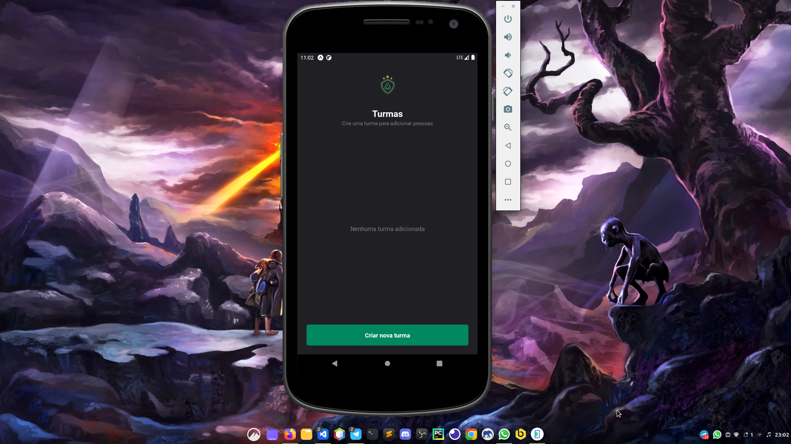

<h1 align="center"> Ignite Teams </h1>  

    
  </a>

  Aplicativo feito no Programa Ignite - React Native,
  o mesmo é focado no gerenciamento de times

## índice

- [Introdução](#introdução)
- [Recursos](#Recursos)
- [Processo para Buildar](#build-process)

<!-- END doctoc generated TOC please keep comment here to allow auto update -->

## Introdução

<!--  -->

Aplicativo totalmente funcional de gerenciamento de filmes, feito totalmente em React Native e com a API do The Movie Database API, feita totalmente sem usar nem aparato pago.

**Disponivel Para Android**

  

