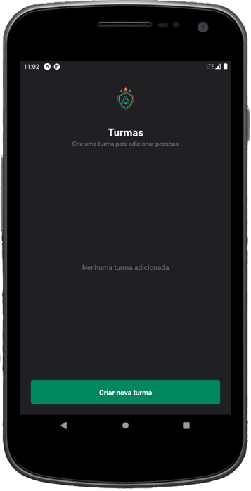
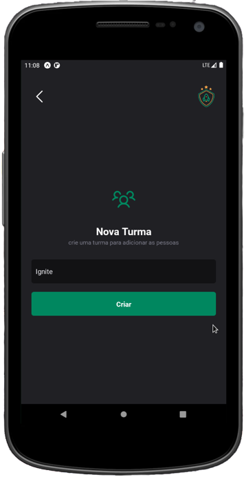
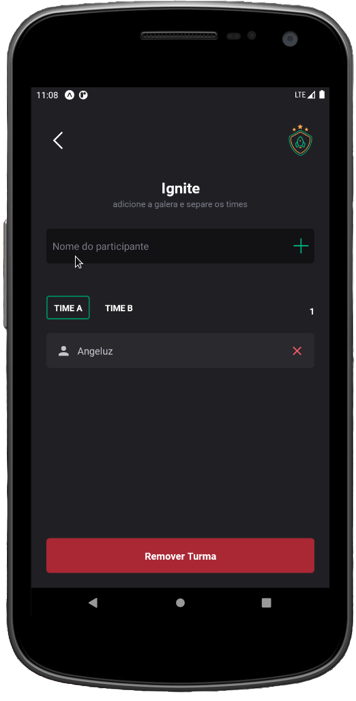

<h1 align="center"> Ignite Teams </h1>  

    
  </a>

  Aplicativo feito no Programa Ignite - React Native,
  o mesmo é focado no gerenciamento de times

## índice

- [Introdução](#introdução)
- [Recursos](#Recursos)
- [Processo para Buildar](#build-process)

<!-- END doctoc generated TOC please keep comment here to allow auto update -->

## Introdução

<!--  -->

Aplicativo é focado na organização de times separados por turmas(grupos)

**Screen 1 -> Turmas**

  

**Screen 2 -> Criar turma**

  

**Screen 3 -> Adicionar Players**

  

## Recursos

* Criar turmas
* Adicionar players
* Filtrar players entre Time A e Time B 
* Remover Players
* Remover Turmas
## Build Process

- Entre no [React Native Guide](https://reactnative.dev/docs/environment-setup) para começar a construir um projeto com código nativo. **Um Mac é necessário se você deseja desenvolver para iOS.**
- Clone ou Baixe o repositorio
- `yarn` ou `npm` para instalar as dependecias -> exemplo: yarn install ou npm install
- `npx react-native run-android` para inicar o projeto 

